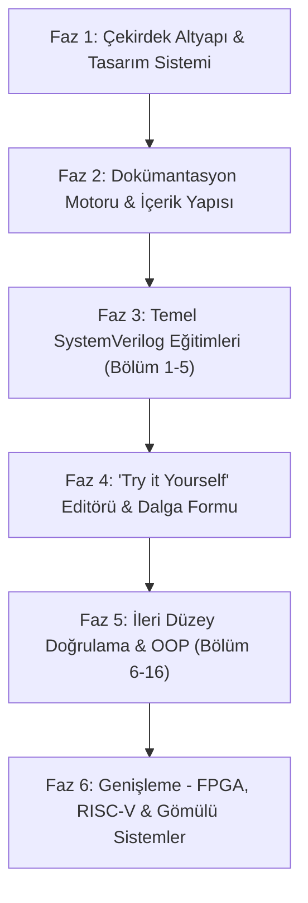

# 🚀 learn.tncy.dev | Modern Embedded Systems & SystemVerilog Learning Platform

W3Schools'un interaktif, adım adım ve kullanıcı dostu öğrenim deneyimini; [ChipVerify](https://chipverify.com/tutorials/systemverilog)'ın kapsamlı donanım tasarımı ve doğrulama (Hardware Design & Verification) müfredatıyla bir araya getiren modern bir eğitim ve laboratuvar platformu.

---

## 📌 Proje Vizyonu

Gömülü sistemler (Embedded Systems), FPGA, ASIC tasarımı ve dijital doğrulama (Verification) alanında öğrenme eğrisi genellikle diktir. **learn.tncy.dev**, karmaşık donanım tanımlama ve doğrulama dillerini modern web teknolojileriyle görselleştiren, interaktif "Try it Yourself" (Kendin Dene) simülasyon ortamları sunan ve endüstri standardı pratikleri öğreten yeni nesil bir açık eğitim platformudur.

Platform ilk etapta **SystemVerilog** ile başlayacak; ilerleyen aşamalarda **Verilog**, **UVM (Universal Verification Methodology)**, **RISC-V**, **FPGA Tasarımı** ve **C/C++ Bare-Metal Gömülü Yazılım** konularına genişleyecektir.

---

## 🛠️ Teknoloji Yığını (Tech Stack)

| Katman | Teknoloji | Açıklama |
| :--- | :--- | :--- |
| **Framework** | [Next.js 16](https://nextjs.org/) (App Router) | Yüksek performanslı React mimarisi, SSR ve Static Generation |
| **Dil** | [TypeScript](https://www.typescriptlang.org/) | Tip güvenliği ve ölçeklenebilir kod tabanı |
| **Stil & Tasarım** | [Tailwind CSS v4](https://tailwindcss.com/) | CSS-first modern utility kütüphanesi |
| **UI Bileşenleri** | [DaisyUI v5](https://daisyui.com/) | Modern, esnek ve temalandırılabilir UI bileşenleri |
| **Kod Editörü** | Monaco Editor / CodeMirror | Web tabanlı interaktif SystemVerilog kod düzenleyici |
| **Sözdizimi Vurgulama**| Shiki / Prism.js | Donanım tanımlama dilleri için zengin tema ve kod renklendirme |
| **Dalga Formu Görselleştirme**| WaveDrom / VCD Viewer | Dijital sinyalleri ve zamanlama diyagramlarını (timing diagrams) görselleştirme |
| **Simülasyon Motoru** | WebAssembly (Verilator / Icarus Verilog) / Cloud Runner | Tarayıcıda veya güvenli sandbox API'de kod çalıştırma ve sonuç üretme |

---

## 🧭 SystemVerilog Müfredatı (ChipVerify Referanslı)

Müfredat, hem **Sentezlenebilir RTL Tasarımı (Design)** hem de **Donanım Doğrulama (Verification)** alanlarını kapsayacak şekilde 16 ana modüle ayrılmıştır:

```
┌────────────────────────────────────────────────────────────────────────┐
│                        learn.tncy.dev Müfredatı                        │
├────────────────────────────────────────────────────────────────────────┤
│ 1. Giriş & Temeller          ► Tasarım vs Doğrulama, Testbench Kavramı │
│ 2. Veri Tipleri              ► logic, bit, byte, int, enum, struct     │
│ 3. Diziler & Koleksiyonlar   ► Packed/Unpacked, Dinamik, Queue, Map    │
│ 4. Akış Kontrolü & RTL       ► always_comb, always_ff, Döngüler        │
│ 5. Zamanlama & Olay Bölgeleri► Delta Cycles, Race Conditions, #0 Delay │
│ 6. Nesne Yönelimli OOP       ► Class, Inheritance, Polymorphism, Cast  │
│ 7. Rastgeleştirme            ► rand, randc, pre/post_randomize         │
│ 8. Kısıtlar (Constraints)    ► Inline, Implication, Solve-Before, Soft │
│ 9. Fonksiyonel Kapsama       ► Covergroup, Coverpoint, Cross Coverage  │
│ 10. Assertions (SVA)         ► Immediate & Concurrent, Property/Seq    │
│ 11. Arayüzler & Modport      ► Interface, Clocking Block, Virtual Intf │
│ 12. İş Parçacıkları (Threads)► fork..join / join_any / join_none       │
│ 13. Süreçler Arası İletişim  ► Mailbox, Semaphore, Event (IPC)        │
│ 14. Testbench Mimarisi       ► Driver, Monitor, Generator, Scoreboard  │
│ 15. İleri Konular & DPI      ► DPI-C (C/C++ Entegrasyonu), Packages    │
│ 16. Mülakat & Pratik Lab     ► Soru Havuzu, Gerçek Dünya Senaryoları   │
└────────────────────────────────────────────────────────────────────────┘
```

---

## ⚡ "Try it Yourself" (Kendin Dene) Mimarisi

Platformun en belirgin özelliği, W3Schools modelini donanım dünyasına uyarlamasıdır:

```
┌───────────────────────────────────────────────────────────────┐
│                    KOD DÜZENLEYİCİ (Sol Panel)                │
│  module counter (input logic clk, output logic [3:0] count);  │
│    always_ff @(posedge clk) count <= count + 1;               │
│  endmodule                                                    │
├──────────────────────────────┬────────────────────────────────┤
│    [ ▶ ÇALIŞTIR BUTONU ]     │    [ ↺ KODU SIFIRLA ]          │
├──────────────────────────────┴────────────────────────────────┤
│                    SONUÇ & ÇIKTI (Sağ Panel)                  │
│  ▶ Konsol Logları (Terminal): $monitor çıktıları               │
│  ▶ Dalga Formu (WaveDrom): CLK __|‾|_|‾|_ | COUNT: 0, 1, 2... │
│  ▶ Durum: PASS / FAIL (Otomatik Test Doğrulama)              │
└───────────────────────────────────────────────────────────────┘
```

### Simülasyon Çalıştırma Stratejisi:
1. **Faz 1 (Görsel & Mock/Simüle Runner):** Önceden derlenmiş test senaryoları, WaveDrom ile interaktif sinyal zamanlama grafikleri ve statik kod analizi.
2. **Faz 2 (Wasm / WebAssembly Simülatör):** Icarus Verilog veya Verilator'ın WebAssembly derlemesiyle doğrudan kullanıcının tarayıcısında sıfır gecikmeli SystemVerilog derleme ve VCD dalga formu üretimi.
3. **Faz 3 (Bulut Sandbox API):** Karmaşık sınıflar, kısıt çözücüler (constraint solvers) ve UVM testleri için güvenli, konteyner tabanlı uzak simülasyon servisi.

---

## 🗺️ Geliştirme Yol Haritası (Roadmap)



### 📍 Faz 1: Çekirdek Altyapı & Tasarım Sistemi (Tamamlandı / Devam Ediyor)
- [x] Node.js (v24+) ve npm ortam doğrulaması
- [x] Next.js 16 (App Router + TypeScript) kurulumu
- [x] Tailwind CSS v4 ve DaisyUI v5 entegrasyonu
- [x] Webpack tabanlı derleme optimizasyonu
- [ ] DaisyUI çoklu tema desteği (Dark, Light, Cyberpunk, Synthwave vb.)
- [ ] W3Schools benzeri 3 sütunlu düzen (Sol: Kategori/Ders Menüsü, Orta: İçerik, Sağ: İçindekiler/Hızlı Başvuru)
- [ ] Mobil uyumlu çekmece (Drawer/Sidebar) ve akıllı arama (⌘K / Ctrl+K)

### 📍 Faz 2: Dokümantasyon Motoru & İçerik Yapısı
- [ ] Markdown / MDX içerik altyapısının kurulması
- [ ] Kod blokları için SystemVerilog sözdizimi renklendirmesi (Syntax Highlighting)
- [ ] Kopyalama butonları, kod satır numaraları ve ipucu kutuları (Info, Warning, Note alerts)
- [ ] Hızlı Başvuru Kartları (Cheatsheets) ve Veri Tipi Karşılaştırma tabloları

### 📍 Faz 3: Temel SystemVerilog Modülleri (Modül 1 - 5)
- [ ] **Giriş:** SystemVerilog nedir, Verilog ile farkları, EDA simülasyon akışı
- [ ] **Veri Tipleri:** `logic`, `bit`, `byte`, `int`, `enum`, `struct`, `union`, `typedef`
- [ ] **Diziler:** Packed vs Unpacked, Dinamik diziler, Kuyruklar (Queues), İlişkisel diziler (Associative)
- [ ] **Kontrol Yapıları:** `always_comb`, `always_ff`, `always_latch`, `unique/priority if-case`
- [ ] **Zamanlama:** Delta döngüleri, yarış durumları (race conditions), `#0` gecikmesi

### 📍 Faz 4: "Try it Yourself" (Kendin Dene) İnteraktif Oyun Alanı
- [ ] Web tabanlı kod editörü bileşeni (Monaco / CodeMirror)
- [ ] Donanım sinyalleri için [WaveDrom](https://wavedrom.com/) zamanlama diyagramı entegrasyonu
- [ ] Çıktı terminali bileşeni (Console/Log ekranı)
- [ ] Her dersin sonuna "Kendin Dene" butonları ve interaktif pratik pencereleri
- [ ] Doğrulama testleri (Check Answer / Testi Çalıştır) ve anlık geri bildirim

### 📍 Faz 5: İleri Düzey Doğrulama & OOP (Modül 6 - 16)
- [ ] **OOP Mimarisi:** Sınıflar, kalıtım, polimorfizm, sanal metodlar, $cast
- [ ] **Rastgeleleştirme & Kısıtlar:** `rand`, `randc`, `constraint`, `solve before`, `inline constraints`
- [ ] **Fonksiyonel Kapsama:** `covergroup`, `coverpoint`, `cross coverage`, `bins`
- [ ] **SVA (SystemVerilog Assertions):** Immediate & Concurrent assertions, Property/Sequence yapıları
- [ ] **Arayüzler & IPC:** `interface`, `modport`, `clocking block`, `mailbox`, `semaphore`, `event`
- [ ] **Tam Testbench Mimarisi:** Generator, Driver, Monitor, Scoreboard entegrasyonu
- [ ] **Mülakat Soruları:** 10 setlik endüstriyel teknik mülakat hazırlık modülü

### 📍 Faz 6: Gömülü Sistemler Ekosistem Genişlemesi
- [ ] **Verilog to Silicon:** RTL'den mantıksal senteze ve FPGA'ya geçiş kılavuzları
- [ ] **UVM (Universal Verification Methodology):** Temel bileşenler ve UVM testbench şablonları
- [ ] **RISC-V Mimarisi:** Temel komut kümesi (ISA) simülasyonu ve özel işlemci çekirdeği tasarımı
- [ ] **Bare-Metal Gömülü C/C++:** Mikrodenetleyiciler, bellek haritalı I/O (MMIO) ve sürücü geliştirme
- [ ] Topluluk katkıları ve kullanıcı ilerleme takibi (Progress Tracker, LocalStorage / Auth)

---

## 💻 Kurulum ve Çalıştırma

Projeyi yerel ortamınızda çalıştırmak için:

```bash
# Bağımlılıkları yükleyin
npm install

# Geliştirme sunucusunu başlatın
npm run dev
```

Tarayıcınızda [http://localhost:3000](http://localhost:3000) adresine giderek projeyi görüntüleyebilirsiniz.

### Diğer Komutlar
```bash
# Üretim derlemesi (Production build)
npm run build

# Derlenmiş projeyi başlatma
npm run start

# ESLint kod kontrolü
npm run lint
```

---

## 📄 Lisans
Bu proje eğitim amaçlı geliştirilmekte olup açık kaynak topluluğuna katkı sağlamayı amaçlar.
